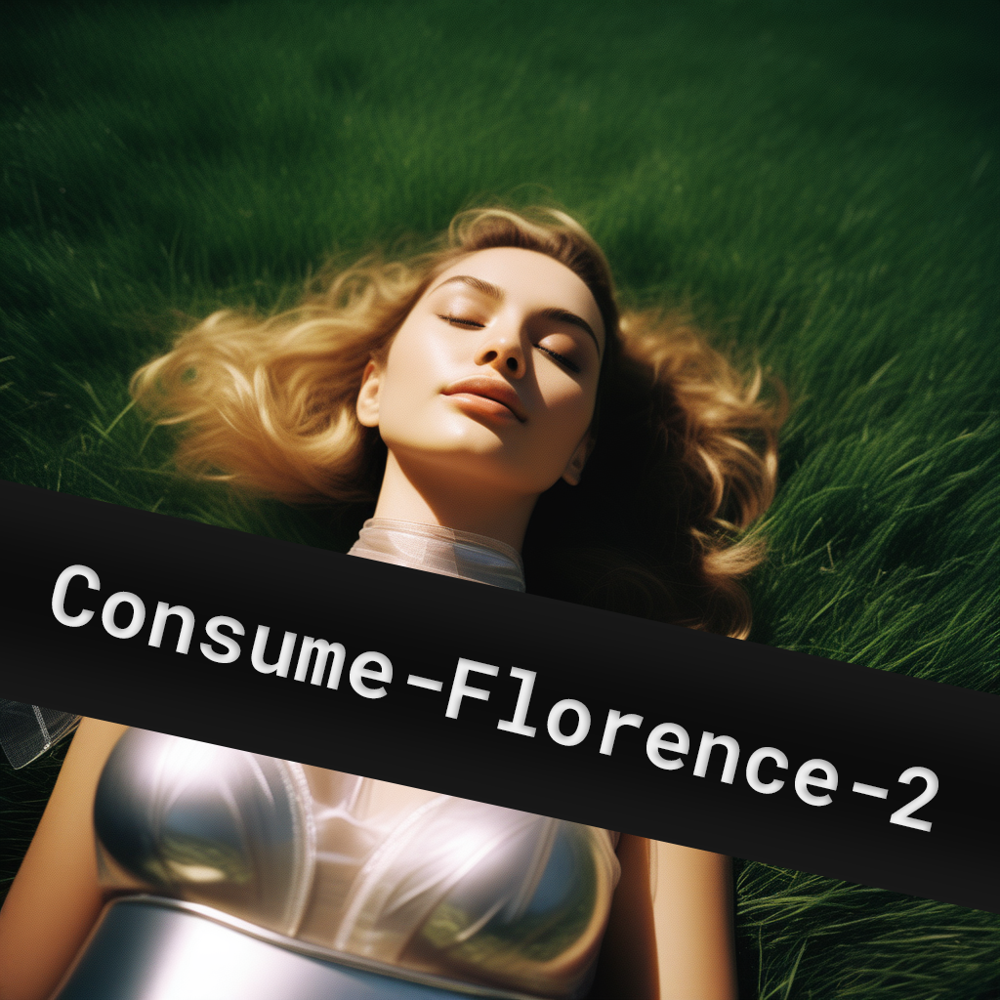

<p align="center">

</p>

# Consume-Florence-2

Welcome to the Consume-Florence-2 repository! This project sets up tools for leveraging Microsoft's state-of-the-art Florence-2 models for various vision tasks.


## Table of Contents
- [Introduction](#introduction)
- [Setup](#setup)
- [Usage](#usage)
- [Contributing](#contributing)
- [License](#license)

## Introduction

Florence-2 is an advanced vision foundation model that uses a prompt-based approach to handle a wide range of vision and vision-language tasks. This repository provides tools to leverage the power of Florence-2 models from Microsoft for tasks such as image captioning, object detection, and more.

Florence-2 can interpret simple text prompts to perform tasks like captioning, object detection, and segmentation. It excels in both zero-shot and fine-tuned settings, proving to be a competitive vision foundation model.

## Available Models

There are four variants of Florence-2 available:

1. Florence-2-large: Pretrained model with FLD-5B (0.77B parameters)
2. Florence-2-large-ft: Finetuned model on a collection of downstream tasks (0.77B parameters)
3. Florence-2-base: Pretrained model with FLD-5B (0.23B parameters)
4. Florence-2-base-ft: Finetuned model on a collection of downstream tasks (0.23B parameters)


## Setup

(TESTED ON UBUNTU 22.04 | CUDA 12.1 | Torch 2.3.1+cu121) <br>
*For Windows, let me know. I'll make a pull request to actually test, but it should work fine.*
<br><br>
Follow the steps below to set up the project:

### Option 1: Using Setup Scripts

#### Linux/Mac:
1. **Download and Run the Shell Script:**
 ```sh
wget https://raw.githubusercontent.com/C0nsumption/Consume-Florence-2/main/setup/setup.sh
chmod +x setup.sh
./setup.sh
 ```

#### Windows:
1. **Download and Run the Batch Script:**
 ```bat
curl -o setup.bat https://raw.githubusercontent.com/C0nsumption/Consume-Florence-2/main/setup/setup.bat
setup.bat
 ```

### Option 2: Manual Installation

<details>
<summary>Manual Installation</summary>

1. **Clone this Repo and Navigate to the Project Directory:**
 ```sh
git clone https://github.com/C0nsumption/Consume-Florence-2.git
cd Consume-Florence-2
 ```

2. **Set Up a Virtual Environment:**
 ```sh
python -m venv venv
source venv/bin/activate # For Linux/Mac
venv\Scripts\activate # For Windows
 ```

3. **Initialize with Git LFS (make sure to have installed. Ask ChatGPT if you need help):**
 ```sh
git lfs install
 ```

4. **Clone the Model Repository:**
 ```sh
git clone https://huggingface.co/microsoft/Florence-2-large
 ```

5. **Install Torch:**
 ```sh
pip install wheel setuptools pip --upgrade
pip install torch torchvision torchaudio --extra-index-url https://download.pytorch.org/whl/cu121
 ```

6. **Install Dependencies:**
 ```sh
pip install -r requirements.txt
pip install flash_attn
 ```

7. **Run Tests:**
 ```sh
python test/test_cli.py
 ```
</details>


## Usage

### Using the CLI

The project includes a Command Line Interface (CLI) for easy interaction. To use the CLI:

1. Navigate to the project root directory.
2. Run the following command:

```bash
python src/cli.py --model-id <path_to_model> --image-path <path_to_image> --task <task_name> [--text-input <additional_text>] [--output-dir <output_directory>]
```

Arguments:
- `--model-id`: Path to the model (required)
- `--image-path`: Path to the image file or URL (required)
- `--task`: Analysis task to perform (required, see valid tasks below)
- `--text-input`: Additional text input for the task, if required
- `--output-dir`: Directory to save output files (default: 'outputs')

Valid tasks:
- `<CAPTION>`
- `<DETAILED_CAPTION>`
- `<MORE_DETAILED_CAPTION>`
- `<OD>`
- `<DENSE_REGION_CAPTION>`
- `<REGION_PROPOSAL>`
- `<CAPTION_TO_PHRASE_GROUNDING>`
- `<REFERRING_EXPRESSION_SEGMENTATION>`
- `<REGION_TO_SEGMENTATION>`
- `<OPEN_VOCABULARY_DETECTION>`
- `<REGION_TO_CATEGORY>`
- `<REGION_TO_DESCRIPTION>`
- `<OCR>`
- `<OCR_WITH_REGION>`

Example:
```bash
python src/cli.py --model-id ./Florence-2-large --image-path ./dataset/000.png --task "<CAPTION>"
```

### Running Tests

To run the tests:

1. Navigate to the project root directory.
2. Run the CLI tests:
   ```bash
   python test/test_cli.py
   ```
3. Run the tests on the ImageAnalyzer class:
   ```bash
   python test/test.py
   ```

The `test.py` script runs through various tasks using the `ImageAnalyzer` class directly, including:
- Basic captioning tasks
- Object detection
- Dense region captioning
- Region proposal
- Phrase grounding
- Referring expression segmentation
- Region to segmentation
- Open vocabulary detection
- Region to category and description
- OCR tasks

These test scripts will run through various tasks and save outputs in the specified output directory.


## Contributing

We welcome contributions from the community! If you'd like to contribute, please fork the repository and submit a pull request. For major changes, please open an issue first to discuss what you would like to change.

1. Fork the Project
2. Create your Feature Branch (`git checkout -b feature/AmazingFeature`)
3. Commit your Changes (`git commit -m 'Add some AmazingFeature'`)
4. Push to the Branch (`git push origin feature/AmazingFeature`)
5. Open a Pull Request

## License

This project is licensed under the MIT License - see the [LICENSE](LICENSE) file for details.

---

Feel free to reach out if you have any questions or need further assistance!

---